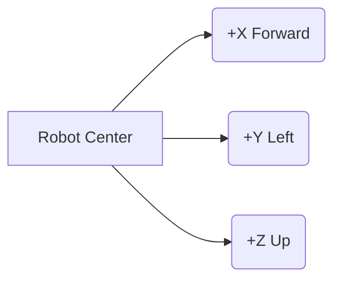
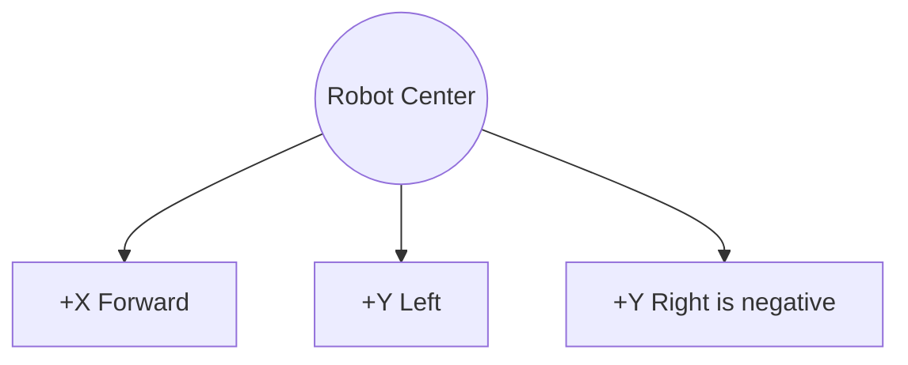
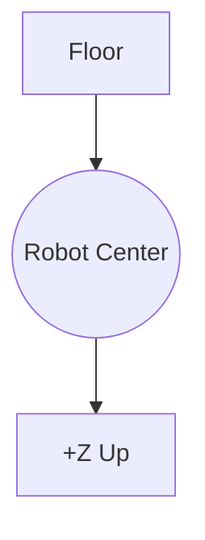
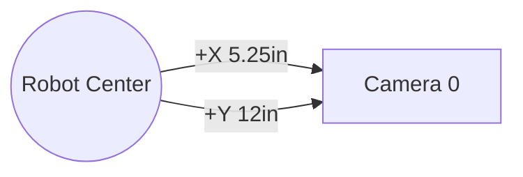

# Camera Transforms (Robot -> Camera)

This document explains how to measure and apply the `kRobotToCams` transforms in [src/main/java/frc/robot/Constants.java](src/main/java/frc/robot/Constants.java).

PhotonVision and WPILib expect a transform from the robot coordinate frame to the camera coordinate frame. That means you measure where the camera is relative to the robot center, then create a `Transform3d(Translation3d, Rotation3d)` using those measured values.

## 1) Coordinate Frames

WPILib uses a right-handed robot coordinate system:

- +X is forward
- +Y is left
- +Z is up

The transform is always **from robot center to the camera**.



### Translation3d

`new Translation3d(x, y, z)` is the **camera position** in meters:

- `x` = forward/back distance from robot center
- `y` = left/right distance from robot center
- `z` = height above robot center

### Rotation3d

`new Rotation3d(roll, pitch, yaw)` is the **camera orientation** in radians:

- `roll` = rotation around +X
- `pitch` = rotation around +Y
- `yaw` = rotation around +Z

Most fixed camera mounts only need yaw. If the camera is tilted up/down, you will also set pitch.

## 2) How to Measure Your Camera

Use a tape measure and the robot CAD/centerline.

1) Find the robot center on the floor (midpoint between wheels, or your CAD origin).
2) Measure the camera lens center relative to that point.
3) Convert inches to meters: `Units.inchesToMeters(value)`.
4) Decide the yaw:
   - Facing forward: `0`
   - Facing left: `+90 deg` or `Math.PI / 2`
   - Facing right: `-90 deg` or `-Math.PI / 2`
   - Facing backward: `180 deg` or `Math.PI`

If the camera is tilted up, pitch is **negative** (nose up) in WPILib convention; if tilted down, pitch is **positive**. Measure tilt with a phone level or angle finder.

## 3) Diagrams and Current Values

### Top-Down Robot View



### Side View (Height)



### Camera 0 - Side (Left-Facing)

Constants:

- Translation (inches): $(5.25, 12, 29.5)$
- Translation (meters): use `Units.inchesToMeters(value)` for each value
- Rotation: yaw $+90^\circ$ (`Math.PI / 2`)

```java
new Transform3d(
  new Translation3d(
    Units.inchesToMeters(5.25),
    Units.inchesToMeters(12),
    Units.inchesToMeters(29.5)
  ),
  new Rotation3d(0, 0, Math.PI / 2)
)
```

Diagram (top view):



### Camera 1 - Front (Forward-Facing)

Constants:

- Translation (inches): $(6.5, 0, 36)$
- Translation (meters): use `Units.inchesToMeters(value)` for each value
- Rotation: yaw $0^\circ$

```java
new Transform3d(
  new Translation3d(
    Units.inchesToMeters(6.5),
    Units.inchesToMeters(0),
    Units.inchesToMeters(36)
  ),
  new Rotation3d(0, 0, Math.toRadians(0))
)
```

Diagram (top view):


### Camera 2 - Spare (Placeholder)

Currently set to zeros. This means the code assumes the camera is at the robot center and facing left, which is not real:

```java
new Transform3d(
  new Translation3d(
    Units.inchesToMeters(0),
    Units.inchesToMeters(0),
    Units.inchesToMeters(0)
  ),
  new Rotation3d(0, 0, Math.toRadians(90))
)
```

Update this when you mount Camera 2.

### Camera 3 - Spare (Placeholder)

Currently set to zeros. This means the code assumes the camera is at the robot center and facing right, which is not real:

```java
new Transform3d(
  new Translation3d(
    Units.inchesToMeters(0),
    Units.inchesToMeters(0),
    Units.inchesToMeters(0)
  ),
  new Rotation3d(0, 0, Math.toRadians(-90))
)
```

Update this when you mount Camera 3.

## 4) Apply Your Measured Values

1) Measure the camera lens center offsets in inches.
2) Decide the yaw (and pitch if the camera is tilted).
3) Replace the values in `kRobotToCams` for your camera.

Example for a camera mounted 8 inches forward, 4 inches right, 28 inches up, and angled 10 degrees down:

```java
new Transform3d(
  new Translation3d(
    Units.inchesToMeters(8),
    Units.inchesToMeters(-4),
    Units.inchesToMeters(28)
  ),
  new Rotation3d(0, Math.toRadians(10), 0)
)
```

## 5) Why This Matters (PhotonVision)

PhotonVision uses these transforms to turn what the camera sees into a robot pose. If the transform is wrong, the robot pose estimate will be wrong, even if AprilTags are detected correctly. The photonvision documentation recommends using accurate camera mounting transforms when estimating robot pose.

References:
- https://github.com/photonvision/photonvision/blob/main/docs/source/docs/integration/advancedStrategies.md
- https://github.com/photonvision/photonvision/blob/main/docs/source/docs/simulation/simulation-java.md
