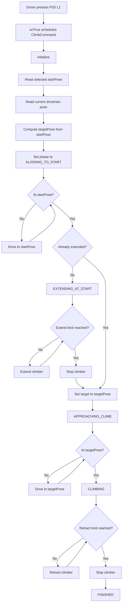

# Climber Flow Diagram

This document describes what happens in code when the driver presses the PS5 `L1` button.

## Trigger

In `RobotContainer.configureBindings()`, the PS5 `L1` button is assigned to `climbTrigger`.

`climbTrigger.onTrue(new ClimbCommand(robotDrive, climber, this::getSelectedClimbStartPose));`

That means a `ClimbCommand` is scheduled once when the button changes from not-pressed to pressed.

## Does The Button Need To Be Held?

No.

Because the binding uses `onTrue(...)` instead of `whileTrue(...)`, the command starts on the press event and then continues running on its own until:

- it reaches the `FINISHED` phase, or
- it is interrupted by some other command that requires the `Drivetrain` or `Climber` subsystem.

Holding the button does not make the command continue any differently. One press is enough to start the full sequence.

## Selected Start Pose

The command gets its start pose from the SmartDashboard chooser:

- `getSelectedClimbStartPose()` returns the currently selected climb pose.
- If nothing is selected, it defaults to `ClimbConstants.kBlueLeftStartPose`.

## Constants Used By The Climber Command

The climb flow depends on constants from two places:

- `src/main/java/frc/robot/Constants.java`
- `src/main/java/frc/robot/commands/climber/ClimbCommand.java`

### Constants from `Constants.ClimbConstants`

- `kBlueLeftStartPose`, `kBlueRightStartPose`, `kRedLeftStartPose`, `kRedRightStartPose`
    Used as selectable climb start locations. The command defaults to `kBlueLeftStartPose` if the chooser returns `null`.
    Location: `src/main/java/frc/robot/Constants.java` in `ClimbConstants`.

- `kDriveForwardDistanceMeters`
    Used in `ClimbCommand.initialize()` to compute `targetPose` by moving forward from `startPose`.
    Location: `src/main/java/frc/robot/Constants.java` in `ClimbConstants`.

- `kDriveMaxSpeedMetersPerSecond`
    Used in `ClimbCommand.driveToPose()` to clamp commanded translation speed while driving to `startPose` or `targetPose`.
    Location: `src/main/java/frc/robot/Constants.java` in `ClimbConstants`.

- `kExtendSpeed`
    Used indirectly by `climber.extendClimber()` during `EXTENDING_AT_START`.
    Location: `src/main/java/frc/robot/Constants.java` in `ClimbConstants`.

- `kRetractSpeed`
    Used indirectly by `climber.retractClimber()` during `CLIMBING`.
    Location: `src/main/java/frc/robot/Constants.java` in `ClimbConstants`.

- `kCurrentSpikeThresholdAmps`
    Used indirectly by the `Climber` subsystem to decide whether extend or retract has hit a hard stop based on current draw.
    Location: `src/main/java/frc/robot/Constants.java` in `ClimbConstants`.

- `kCurrentAverageWindowSeconds`
    Used indirectly by the `Climber` subsystem to define the moving-average window for current spike detection.
    Location: `src/main/java/frc/robot/Constants.java` in `ClimbConstants`.

- `kMotorCanId`, `kMotorInverted`, `kMotorCurrentLimit`
    Used indirectly by the `Climber` subsystem to configure the climber motor controller.
    Location: `src/main/java/frc/robot/Constants.java` in `ClimbConstants`.

### Constants from `Constants.NavigationConstants`

- `kPositionP`, `kPositionI`, `kPositionD`
    Used to create the X and Y PID controllers in `ClimbCommand`.
    Location: `src/main/java/frc/robot/Constants.java` in `NavigationConstants`.

- `kRotationP`, `kRotationI`, `kRotationD`
    Used to create the rotation PID controller in `ClimbCommand`.
    Location: `src/main/java/frc/robot/Constants.java` in `NavigationConstants`.

- `kPositionTolerance`
    Used in two places:
    as the PID controller tolerance, and in `isAtPose(...)` as part of the translation arrival test.
    Location: `src/main/java/frc/robot/Constants.java` in `NavigationConstants`.

- `kRotationTolerance`
    Used in two places:
    as the PID controller tolerance, and in `isAtPose(...)` as the heading arrival test.
    Location: `src/main/java/frc/robot/Constants.java` in `NavigationConstants`.

- `kMaxAngularSpeed`
    Used in `driveToPose(...)` to clamp rotation speed while driving to a pose.
    Location: `src/main/java/frc/robot/Constants.java` in `NavigationConstants`.

- `kFieldLength`, `kFieldWidth`
    Used indirectly when the predefined climb start poses are constructed in `ClimbConstants`.
    Location: `src/main/java/frc/robot/Constants.java` in `NavigationConstants`.

### Constant local to `ClimbCommand`

- `kMinTranslationErrorForArrivalMeters`
    Defined inside `ClimbCommand` as `Units.inchesToMeters(1.0)`.
    Used in `isAtPose(...)` to enforce a minimum arrival threshold even if the navigation position tolerance is set smaller.
    Location: `src/main/java/frc/robot/commands/climber/ClimbCommand.java`.

### SmartDashboard keys written by `ClimbCommand`

These are not motion-tuning constants, but they are fixed string values used by the command for telemetry:

- `ClimbCommand/Running`
- `ClimbCommand/Phase`
- `ClimbCommand/InitialPose`
- `ClimbCommand/SelectedStartPose`
- `ClimbCommand/TargetPose`
- `ClimbCommand/AtStartPose`
- `ClimbCommand/CurrentPoseX`
- `ClimbCommand/CurrentPoseY`
- `ClimbCommand/CurrentHeadingDegrees`
- `ClimbCommand/LastResult`

Location: `src/main/java/frc/robot/commands/climber/ClimbCommand.java`.

## Sequence Overview

When the command is scheduled, it runs through these phases:

1. `ALIGNING_TO_START`
2. `EXTENDING_AT_START`
3. `APPROACHING_CLIMB`
4. `CLIMBING`
5. `FINISHED`

## Detailed Flow

### 1. Command initialization

When `ClimbCommand.initialize()` runs:

- it reads the selected climb start pose from the chooser
- it reads the robot's current pose from `drivetrain.getPose()`
- it computes `targetPose` by moving forward from `startPose` by `ClimbConstants.kDriveForwardDistanceMeters`
- it sets the phase to `ALIGNING_TO_START`
- it stops the climber motor
- it resets the PID controllers
- it sets the drive PID targets to `startPose`
- it publishes status to SmartDashboard

### 2. ALIGNING_TO_START

In `execute()`, if the phase is `ALIGNING_TO_START`:

- the robot drives toward `startPose` using `driveToPose(startPose)`
- that helper uses the current fused drivetrain pose and PID controllers to generate chassis speeds
- the phase does not change until `isAtPose(currentPose, startPose)` is true

When the robot reaches `startPose`:

- the drivetrain is stopped
- if the climber is already extended, the command skips to `APPROACHING_CLIMB`
- otherwise it goes to `EXTENDING_AT_START`

### 3. EXTENDING_AT_START

If the phase is `EXTENDING_AT_START`:

- the drivetrain stays stopped
- the climber calls `extendClimber()` until `isExtendLimitReached()` becomes true

`isExtendLimitReached()` is true when either:

- the forward limit switch is pressed, or
- the climber current spike logic says the extend stop has been reached

Once extended:

- the climber motor is stopped
- the phase changes to `APPROACHING_CLIMB`

### 4. APPROACHING_CLIMB

If the phase is `APPROACHING_CLIMB`:

- the command calls `setDriveTarget(targetPose)`
- the robot drives toward `targetPose` using `driveToPose(targetPose)`
- this continues until `isAtPose(currentPose, targetPose)` is true

When `targetPose` is reached:

- the drivetrain is stopped
- the phase changes to `CLIMBING`

### 5. CLIMBING

If the phase is `CLIMBING`:

- the drivetrain stays stopped
- the climber calls `retractClimber()` until `isRetractLimitReached()` becomes true

`isRetractLimitReached()` is true when either:

- the reverse limit switch is pressed, or
- the climber current spike logic says the retract stop has been reached

Once retracted:

- the climber motor is stopped
- the phase changes to `FINISHED`

### 6. Command end

When the command ends, `end(boolean interrupted)`:

- stops the drivetrain
- stops the climber motor
- sets `ClimbCommand/Running` to false on SmartDashboard
- records whether the command was completed or interrupted

## Flow Diagram

## Important Behavioral Note

The sequence is not tied to the button being held.

The important distinction is:

- `onTrue(...)` means start once on press
- `whileTrue(...)` would mean run only while held

This code uses `onTrue(...)`, so one press starts the full climb sequence.